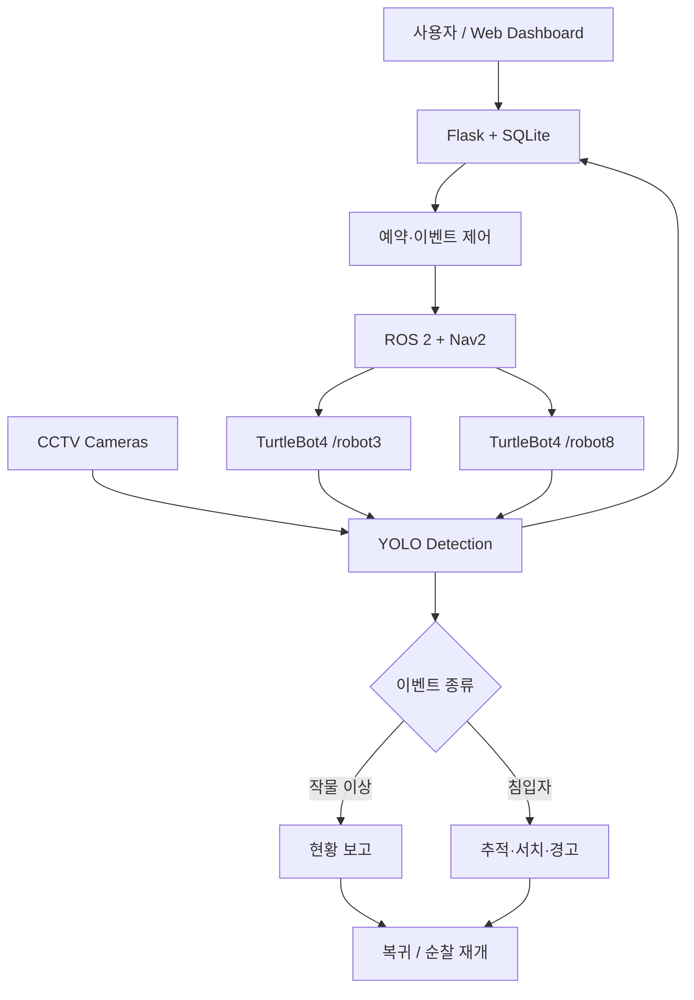

# GreenGuard — 다중 AMR 스마트팜 안전 모니터링

TurtleBot4, AI 영상 인식, 웹 모니터링과 데이터베이스를 연결해 작물 이상과 침입자를 감지하고 대응하는 ROS 2 시스템입니다.

▶ [1분 시연 영상](https://drive.google.com/file/d/1r9bpvAV6bQ-7X2AgRfBYn_sL5UoxdXag/view)

## 주요 기능

- TurtleBot4 2대의 예약 순찰, Nav2 자율주행, 도킹·복귀
- 고정 카메라의 병든 토마토와 침입자 감지
- AMR 카메라 기반 침입자 추적·서치와 경고음 출력
- 로봇 영상·위치·배터리·이벤트를 Flask 웹 화면에서 통합 확인
- SQLite 기반 사용자·운영 로그 기록과 조회

## 시스템 구조



[전체 시스템 설계도](docs/system_design_full.png)는 PC·카메라·AMR별 노드와 세부 시나리오 흐름을 함께 표시합니다. 편집 원본은 [draw.io 파일](docs/system_design.drawio)로 보관했습니다.

## 개발 환경

| 구분 | 구성 |
|---|---|
| OS / Middleware | Ubuntu 22.04, ROS 2 Humble |
| Mobile Robot | TurtleBot4 × 2, Nav2, SLAM/AMCL |
| Vision | OAK-D, CCTV, YOLOv8, OpenCV |
| Monitoring | Flask, SQLite, HTML/CSS/JavaScript |
| Language | Python |

## 저장소 구조

```text
├── src/amr/pressedfinal/       순찰·추적·경고·보고 ROS 2 패키지
├── src/vision/publish_package/ 고정/AMR 카메라 YOLO 추론 패키지
├── monitoring/                 Flask 대시보드와 SQLite 모듈
└── docs/                       전체 시스템 설계도
```

## 빌드

두 ROS 2 패키지를 워크스페이스의 `src` 아래에 배치한 뒤 빌드합니다.

```bash
source /opt/ros/humble/setup.bash
cd ~/greenguard_ws
colcon build --symlink-install
source install/setup.bash
```

비전·모니터링에는 `ultralytics`, `opencv-python`, `Flask` 등 Python 의존성이 필요합니다. 모델 경로, 로봇 namespace, DB 경로는 현재 환경에 맞게 확인해야 합니다.

## 웹 인증 설정

웹 관제 실행 전에 관리자 계정과 Flask 세션 키를 환경변수로 설정합니다.

```bash
export GREENGUARD_ADMIN_USERNAME=admin
export GREENGUARD_ADMIN_PASSWORD='change-this-password'
export GREENGUARD_SECRET_KEY='change-this-long-random-secret'
```

비밀번호는 초기 DB 생성 시 해시로 저장됩니다. 운영 중인 DB의 계정을 바꾸려면 기존 DB를 마이그레이션하거나 새 DB를 생성해야 합니다.

## 실행

```bash
# AMR 순찰 모드: 경고음 + AMR YOLO + 순찰
ros2 launch pressedfinal patrol.launch.py

# 현황 보고 모드
ros2 launch pressedfinal report.launch.py

# CCTV 감지 이벤트로 보고 시작
ros2 launch pressedfinal start_report.launch.py

# 다중 AMR / 고정 카메라 비전
ros2 run publish_package yolo_detection_turtlebot
ros2 run publish_package yolo_detection_tomato

# 웹 모니터링
cd monitoring
cp config.example.json config.json
python3 web.py
```

## 주요 인터페이스

| 토픽·액션 | 내용 |
|---|---|
| `/robot3/reserve` | 예약 간격 전달 |
| `/robot3/amcl_pose`, `/robot8/amcl_pose` | AMR 위치 |
| `/detection/tomato/rotten` | 병든 작물 인식 영상 |
| `/detection/cctv/human` | 고정 카메라 침입자 인식 영상 |
| `/detection/robot3/flag`, `/detection/robot8/flag` | AMR 침입자 감지 이벤트 |
| `/robot3/warning` → `/robot3/cmd_audio` | 경고 상태와 음성 출력 |
| `/robot3/dock`, `/robot8/undock` | 도킹·언도킹 액션 |

## 통합 시나리오

1. 예약 시간에 AMR이 순찰하며 병든 작물 상태를 보고합니다.
2. 고정 카메라가 침입자를 감지하면 AMR이 지정 구역으로 이동해 추적·서치하고 복귀합니다.
3. 순찰 중 침입자를 발견하면 경고·추적 모드로 전환한 뒤 순찰을 재개합니다.

최종 시연에서는 세 시나리오가 시작 이벤트부터 종료·복귀까지 연결되는 것을 확인했습니다. 장시간 안정성과 다양한 조명·배치에서의 정량 성능은 별도 검증이 필요합니다.
